# Fork Management

The Solana network is eventually consistent. Each validator has their
own view of global state and consensus. This means that Firedancer may
momentarily see conflicting blocks, and that any block may get reverted
until it is confirmed.

In order to resolve such network partitions, Firedancer has to
simultaneously follow multiple forks, persist the blocks that win (i.e.
get rooted), and prune the ones that lose.

::: tip NOTE

Firedancer is natively _multi-versioned_:

It _concurrently_ executes transactions on multiple live forks.

:::

## Example

Consider the following fork graph (where A is the oldest block).

B, A->C->D" width="300" />

The validator roots C, pruning A and B. (`advance_root(C)`)

D" width="190" />

The validator attaches an additional child fork. (`attach_child(E)`)

D->E" width="300" />

## Consensus Events

The `tower` (consensus) and `replay` tiles originate the following
consensus events:

### `slot_completed`

A block finished replaying. Data associated with this block is now
immutable.

### `root_advanced`

A block was finalized. Cancel all conflicting blocks. Release views and
resources to prior blocks.

See the section [rooting](../glossary#root-rooting) for more details.

### `reasm_evicted`

Excessive forking caused a fork node to get evicted.

## Replay Tile

Decisions regarding fork management are made in the replay tile:
- Advance the root slot when it is safe to do so.
- Allocate new fork graph nodes when the block starts
- Evict nodes when running out of resources

The replay tile broadcasts fork events to all other tiles in the system
via reliable links.

## Components

Due to Firedancer's modular internal architecture, components of the
validator are freestanding shared memory objects. Because of this, they
independently maintain their own fork graph.

- accdb: account database
- banks: bank manager
- progcache: BPF program cache
- reasm: block reassembly
- sched: replay scheduler
- txncache: status cache

The replay tile is responsible for fork graph operations on all of the
above components. Components do not necessarily advance in lockstep, as
a fork may be pruned before reaching all components.

## Bank ref counts

The bank manager has a special role in the system.
It maintains an external reference count for each bank (fork).

Tiles may only reference forks in other components while they hold a ref
in the bank.

::: details SAFETY

Before advancing the root slot, the replay tile ensures that the root
slot has no active references.

:::

Because of the above ref count mechanism, if the ref count of a bank
reaches zero, it is safe to reclaim equivalent fork nodes in all other
components.

