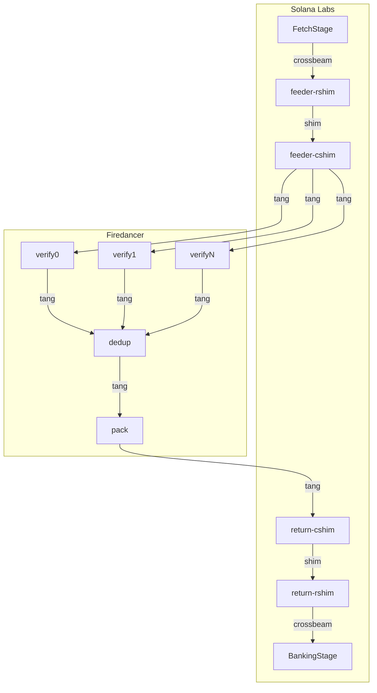

Frankendancer
=============

The following guide walks through a demo of a Firedancer/Solana Labs-hybrid
block producer.

This first incarnation of Frankendancer is called "Frank".

Prerequisites
-------------

Operating Firedancer requires the following steps:
- [build.md](./build.md): Building the Firedancer source code
- [system.md](./system.md): Configuring your system for Firedancer

Changelog
---------

TODO Everything below is outdated:

## Changes

The changes made to the TPU (transaction processing unit) enable a Solana Labs validator to use Firedancer’s high-performance implementation of the SigVerify stage.

This stage is part of a node’s block production duties and serves to filter incoming traffic down to a manageable rate, and authenticate packets. Firedancer adds a pre-packing stage which sorts transactions by estimated validator reward and filters throughput per state hotspot.
It also applies heuristics to predict execution cost to schedule transactions in a way that banking stage throughput is optimized.

The message passing frameworks used in Firedancer and the Labs validator (tango and crossbeam) are incompatible and require a language-agnostic compatibility layer. A simple shared-memory based ring buffer with C and Rust bindings was created for this purpose, called “shim”. “cshim” and “rshim” are the C and Rust libraries respectively.

The **feeder** shim inputs ingested packets into the Firedancer sigverify/dedup/pack pipeline, and the *return* shim returns the output back to the Labs validator.

While Frankendancer’s SigVerify stage was demonstrated at line rate in isolation, the performance in a real validator is expected to be lower due to the high overhead of the shim module.

Once milestone 1.1 is completed, the **feeder** shim can be removed to achieve ingestion at line rate.
The **return** shim can be removed by adding Rust bindings for Firedancer’s “tango” message passing library.

## High-level Architecture

### Component Diagram

Light grey boxes represent process boundaries.
Dark grey boxes represent logical components.



### Shim

The `shim` library provides streaming IPC between Firedancer (Tango messaging) and the Solana Labs validator (Crossbeam messaging).

Currently, it consists of a simple channel interface for reliably transferring messages with single-producer single-consumer semantics.

`shim` was designed to simplify integration between the two clients.
It is less performant than Firedancer Tango but tests have shown it can operate at line rate.

In the long term, `shim` will be replaced as other milestones get completed (e.g. Milestone 1.1 TPU/QUIC).

## Usage

### Prerequisites

- Recent Linux machine
- C/C++ build toolchain
    - LLVM 14 or newer
    - Make
    - libnuma
    - Sane environment (linker, libc)
- Rust toolchain (rustup)
- A new empty project folder (all code snippets assume you start out in this folder)

### **Build Firedancer and Solana**

```bash
# Build Firedancer
git clone https://github.com/firedancer-io/firedancer
cd firedancer
git checkout milestone-1.2-demo
MACHINE=linux_clang_x86_64 make -j CC=clang CXX=clang++

# Build Solana
cd ..
git clone https://github.com/firedancer-io/solana
cd solana
git checkout milestone-1.2-demo
cargo build --release \
  --package solana-validator \
  --package solana-bench-tps \
  --package solana-dos \
  --package solana-cli \
  --package solana-frank-test
```

### Configure system

Follow Firedancer’s README to increase the `memlock` ulimit. This is required to allocate hugepages.

Then, setup your workspace.

**Machine Type:** 16 threads, 64GiB memory

```bash
cd firedancer/build/linux/clang/x86_64

# Sets up permissions for shared memory setup
sudo ./bin/fd_shmem_cfg init 0700 "$(whoami)" ""

# Allocate 2x 1GiB pages, 512x 2MiB pages on NUMA node 0
sudo ./bin/fd_shmem_cfg alloc 2 gigantic 0 alloc 512 huge 0

# Setup Firedancer to run on threads 0-8 with 4 sigverify tiles
./bin/fd_frank_init frank 0-8 4 .
```

**Machine Type:** 48 threads, 256GiB memory

```bash
cd firedancer/build/linux/clang/x86_64

# Allocate 8x 1GiB pages on NUMA node 0
./bin/fd_shmem_cfg alloc 8 gigantic 0

./bin/fd_frank_init frank 0 4 .
```

**Set pack QoS goal**

The pack tile has a configurable per-block CU limit. This can be updated as follows:

```bash
./bin/fd_pod_ctl update "$POD" uint  "$APP".pack.cu-limit 12000001
```

### Run fd_frank

`fd_frank` packages the tile system running the signature verification pipeline.

Run it to start listening on shm for incoming packets.

```bash
cd firedancer/build/linux/clang/x86_64

# Run Firedancer binary
./bin/fd_frank_run frank 0-7
```

### Run solana-test-validator

`solana-test-validator` spins up a local network consisting of one node with a new genesis.

The `--frank` flags instruct the node to connect to the Firedancer components.

```bash
cd solana

source ../firedancer/build/linux/clang/x86_64/tmp/frank.cfg
./target/release/solana-test-validator \
  --frank                            \
  --frank-app-name "$APP"            \
  --frank-wksp "$POD"                \
  --frank-sigverify-tiles 0-4        \
  --bind-address       127.0.0.1     \
  --dynamic-port-range 8000-8200     \
  --rpc-port           8899          \
  --faucet-port        9900          \
  --faucet-sol         1000000000    \
  --reset
```

### Run solana-frank-test

To test at more aggressive scale, `solana-frank-test` can be used in place of a real validator (like `solana-test-validator`).

`solana-frank-test` will run packet generation and present a mock banking stage that Firedancer outputs to.

```bash
cd solana

source ../firedancer/build/linux/clang/x86_64/tmp/frank.cfg
./target/release/solana-frank-test \
  --app-name "$APP"     \
  --wksp "$POD"         \
  --sigverify-tiles 0-4 \
  --packet-cnt      4000000
```

### Run Firedancer monitor

The `fd_frank_mon` tool displays sequence numbers, rates (tps, bandwidth), backpressure, overruns.

```bash
cd firedancer/build/linux/clang/x86_64

./bin/fd_frank_mon --duration 1e12
```

### Create Solana CLI config

We create a Solana CLI config pointing to our local validator instance so we can start sending transactions.

```bash
cat <<EOF > ./solana_cli.yml
json_rpc_url: http://127.0.0.1:8899
websocket_url: ws://127.0.0.1:8900
keypair_path: "$(pwd)/solana/test-ledger/faucet-keypair.json"
EOF
```

### Send a single tx

Demo sending individual transactions via RPC.

```bash
./solana/target/release/solana -C ./solana_cli.yml \
  transfer FuctHhYipYEeQqo81yDR21Lt4jC1fTA81jH3up7NFxqR 1 --allow-unfunded-recipient
```

### Deploy a program

Download Pyth from main-net and deploy it to the local network

```jsx
# Download Pyth from mainnet
./solana/target/release/solana  \
     program dump -um FsJ3A3u2vn5cTVofAjvy6y5kwABJAqYWpe4975bi2epH ./pyth.so

# Redeploy Pyth locally
./solana/target/release/solana -C ./solana_cli.yml \
 		 program deploy ./pyth.so
```

### Run valid transaction spammer

The `solana-bench-tps` tool spams valid transactions from multiple fee payers.

```bash
./solana/target/release/solana-bench-tps \
    --config           ./solana_cli.yml \
    --entrypoint       "127.0.0.1:8000" \
    --num-nodes         1               \
    --threads           4               \
    --tx_count          5000            \
    --duration          20000           \
    --use-tpu-client                    \
    --tpu-disable-quic
```

### Debug shim channels

To see the contents of the Rust-C shims, run the following

```bash
ls -la /proc/$(pidof solana-test-validator)/fd | grep shm
```

- The `fctl` object contains the latest message sequence number that has been acknowledged by the reader
- The `fmsg` object contains the message (24B header, 8B footer)

## Tango Architecture

```
                    from external facing NICs
  (interface via mixture of AF_XDP, sockets, ENA, IO uring, DPDK,                      nic ideally near numa node as
    Verbs, Mellanox Exanic, Solarflare, Intel RDMA, PCAP, ...)                         corresponding ingress processing core
     |               |                               |
     | raw           | raw                           | raw
     | packets       | packets                       | packets
     |               |                               |
     |       +------ | ------+--------- ... -------- | ------+-----------+
     |       |       |       |                       |       |           |
     |       v       |       v                       |       v           |
     |  +- wksp --+  |  +- wksp --+                  |  +- wksp --+      |
     |  |  FSEQ   |  |  |  FSEQ   |     ...          |  |  FSEQ   |      |
     |  +---------+  |  +---------+                  |  +---------+      |
     |       |       |       |                       |       |           |
     v       v       v       v                       v       v           |
  +--- core ----+ +--- core ----+                 +--- core ----+        |             cores ideally near numa node as connected
  | NIC / QUIC  | | NIC / QUIC  |                 | NIC / QUIC  |        | flow        obj wksps, several flavors of these tiles
  | SIG VERIFY  | | SIG VERIFY  |       ...       | SIG VERIFY  |        | control     for different HPC NIC interface styles,
  |  DEDUP TAG  | |  DEDUP TAG  |                 |  DEDUP TAG  |        | info        up to 64-bit tags (per validator run
  +-------------+ +-------------+                 +-------------+        |             randomized tagging scheme for robustness)
     |       |       |       |                       |       |           |
     |       v       |       v                       |       v           |
     |  +- wksp --+  |  +- wksp --+                  |  +- wksp --+      |
     |  | MCACHE  |  |  | MCACHE  |     ...          |  | MCACHE  |      |             very deep
     |  +---------+  |  +---------+                  |  +---------+      |
     |       |       |      |                        |       |           |
     |       |       |      |                        |       |    +--- core ----+      core ideally near numa node as connected
     |       v       |      v                        |       v    | FILT RECENT |      obj wksps, performance liekly bounded by NOC
     |       +------ | -----+---------- ... -------- | ------+--->|  DUP TAGS   |      metadata handling limit (i.e. undeduped
     |               |   metadata w/tag              |            |     MUX     |      transaction rate, not raw packet bandwidth)
     |               |    for verified               |            +-------------+
     |               |    transactions               |               |       ^
     v               v                               v               v       |
+- wksp --+     +- wksp --+                     +- wksp --+     +- wksp --+  |
| DCACHE  |     | DCACHE  |             ...     | DCACHE  |     | MCACHE  |  |         very deep
+---------+     +---------+                     +---------+     +---------+  |
     |               |                               |               |       |
     v               v                               v               |  +- wksp --+
     +---------------+------------+---- ... ---------+               |  |  FSEQ   |
               verified           |                                  |  +---------+
             transactions         |                                  |       ^
                                  |         +------------------------+       |
                                  |         |     sequenced metadata         |
                                  v         v    for deduped verified        |
                               +---- core -----+     transactions            |
                               |     BLOCK     |                             |         core ideally near muma node as connected
                               |    PACKING    |-----------------------------+         obj wksps, performance likely bounded by NOC
                               |               |      flow control info                deduped transaction payload bandwidth
                               +---------------+
                                       |
                                       | blocks
                                       v
                               +---- wksp -----+                                       very deep, consider implementing as
                               |  block store  |                                       MCACHE / DCACHE pair with Rust shims for use
                               +---------------+                                       in Solana validator
                                       |
                                       v
                              to Solana validator
                             for block distribution
                                 and execution
```

- cnc / monitoring communication flows omitted for clarity

- Targets using a high core count recent x86 CPUs with one or more CPU
  sockets.  No custom hardware but see below.

- Target 1 gigantic page backed wksp for shared memory objects per each
  NUMA node used.  Ideally should keep the number of NUMA nodes touched
  by each core minimal in core / wksp placement.

- Use of named wksp allows dynamic inspection, monitoring, debugging of
  live operations / non-invasive capture of components inputs / etc
  (standard UNIX permissions model).

- Similarly, support for hotswapping individual components live (e.g.
  adding / removing ingress tiles on the fly to deal with load changes,
  failed hardware, etc) is possible long term under this model.

- This plus the above allows use of captures / replay for reproducible
  development and debugging of individual components in isolation.

- Can run the above as a single process / multi-threaded model or as a
  multi-process / multi-threaded model or any mix in between.  Current
  implementation is single process with named workspaces with support
  for quick refactoring into multi-process model if useful.

- Communications path from NIC(s) to Solana validator is reliable for
  simplicitly / reproducibility.

- And, as such, these sub-components could potentially be moved (in part
  or in whole) into FPGA / ASIC / GPU accelerated (as might be useful
  long term) so long as they follow the Tango ABI.

- Assumes DEDUP needs to be done after SIG VERIFY due to encryption and
  the like.

- Uses Tango metadata signature field (and maybe other bits) to do
  transaction tagging to parallelize dedup calculations and support
  horizontal scaling (e.g. multiple high bandwidth NICs for high through
  ingress and high core count available for SIG-VERIFY parallelization).

- SIG VERIFY naturally should produce a cryptographically secure as part
  of the SHA-512 computation for use by dedup with no additional
  computation.  If for whatever reason this isn't usable, any number
  of hashing algorithms could be run in parallel.

- NIC / QUIC / SIG VERIFY / TAG core can be pipelined vertically over
  multiple cores if useful in addition to the horizontal support already
  implemented for additional compute bandwidth.

## Pod layout for low level configuration

```
[path to this frank instance's config] {

  # There are 3 + verify_cnt tiles used by frank.  verify_cnt is implied
  # by the number of verify pods below.
  #
  # The logical tile indices for the main, pack and dedup tiles are
  # independent of the number of verifiers.
  #
  # Further, since all IPC structures below are in a named workspace,
  # monitors / debuggers with appropriate permissions can inspect the
  # data flows non-invasively real time and/or issue commands to
  # individual tiles out-of-band.
  #
  # The use of the pod and wksp allows this to be refactored into a
  # multi-process model with minimal changes and/or allow for additional
  # verify tiles to be dynamically attached / removed while running
  # longer term if desirable.

  main {

    # Run logical tile 0 and largely sleeps (reasonable to float)

    cnc [gaddr] # Location of this tile's command-and-control

    # Additional configuration information specific to this tile here
    # (all unrecognized fields will be silently ignored)

  }

  pack {

    # Runs on logical tile 1 and largely spins (ideally on a dedicated
    # core near NUMA node for IPC structures used by this tile)

    cnc  [gaddr] # Location of this tile's command-and-control

    seed [uint]  # This tile's random number generator seed
                 # Optional: tile_idx if not provided

    # Additional configuration information specific to this tile here
    # (all unrecognized fields will be silently ignored)

  }

  dedup {

    # Runs on logical tile 2 and largely spins (ideally on a dedicated
    # core near NUMA node for IPC structures used by this tile)

    cnc     [gaddr] # Location of this tile's command-and-control
    tcache  [gaddr] # Location of this tile's unique frag signature cache
    mcache  [gaddr] # Location of this tile's deduped verified frag metadata cache
    fseq    [gaddr] # Location where this tile receives flow control from the pack tile
    cr_max  [ulong] # Max credits for publishing to pack
                    # 0: use reasonable default
                    # Optional: 0 if not provided
    lazy    [long]  # Flow control laziness (in ns)
                    # <=0: use reasonable default
                    # Optional: 0 if not provided
    seed    [uint]  # This tile's random number generator seed
                    # Optional: tile_idx if not provided

    # Additional configuration information specific to this tile here
    # (all unrecognized fields will be silently ignored)

  }

  verify {

    # verify_cnt pods in this pod

    [verify_idx name] {

      # Runs on logical tile 3+verify_idx and largely spins (ideally on
      # a dedicated core near NUMA node for NIC and IPC structures).
      #
      # While users should not be exposed to it directly, the index of a
      # verify starts from 0 and is sequentially assigned based on the
      # order of the subpods in the config.

      cnc       [gaddr] # Location of this tile's command-and-control
      mcache    [gaddr] # Location of this tile's verified frag metadata cache
      dcache    [gaddr] # Location of this tile's verified frag payload cache
      fseq      [gaddr] # Location where this tile receives flow control from the dedup tile
      cr_max    [ulong] # Max credits for publishing to dedup
                        # 0: use reasonable default
                        # Optional: 0 if not provided
      cr_resume [ulong] # Credit thresh to stop polling dedup for credits
                        # 0: use reasonable default
                        # Optional: 0, if not provided
      cr_refill [ulong] # Credit thresh to start polling dedup for credits
                        # 0: use reasonable default
                        # Optional: 0, if not provided
      lazy      [long]  # Flow control laziness (in ns)
                        # <=0: use reasonable default
                        # Optional: 0 if not provided
      seed      [uint]  # This tile's random number generator seed
                        # Optional: tile_idx if not provided

      # Additional configuration information specific to this tile here
      # (all unrecognized fields will be silently ignored)

    }

    # Additional configuration information specific to all verify tiles
    # here (all unrecognized fields will be silently ignored).  Any such
    # configuration information should not be in a pod.

  }

  # Additional configuration information specific to this frank instance
  # (all unrecognized fields will be silently ignored)
}

# (all other fields outside this path will be silently ignored)
```

