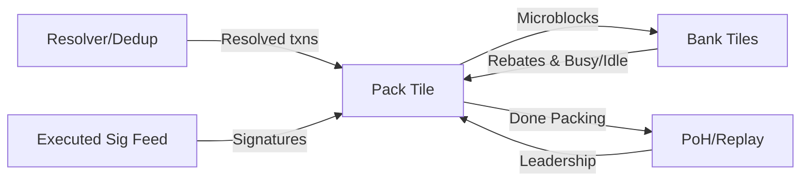
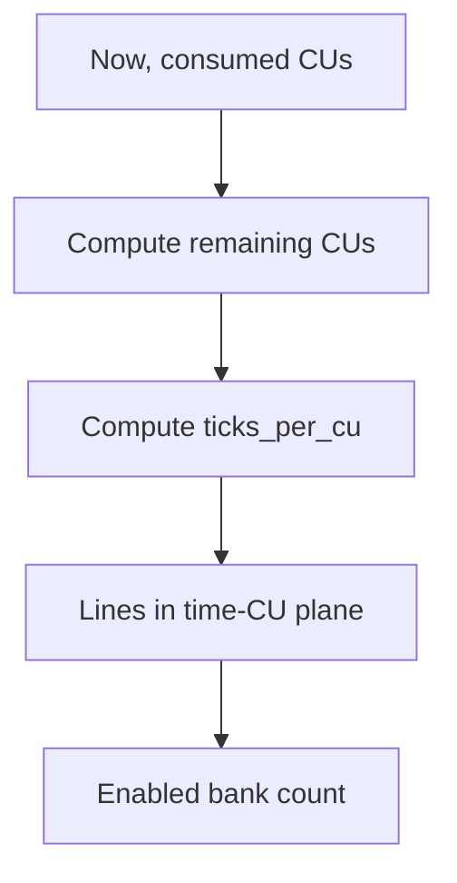
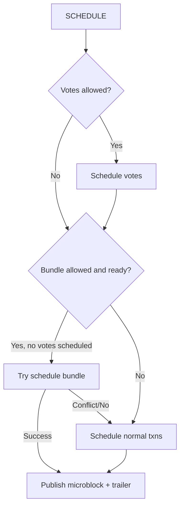

## Firedancer Pack Tile and Pack Algorithm — Technical Documentation

### Audience
- Researchers and PhD students in systems/algorithms seeking a deep understanding of Firedancer’s pack subsystem.

### Scope
- How the `pack` tile orchestrates microblock formation and scheduling across bank tiles.
- The internals of the `fd_pack` algorithm: data structures, invariants, insertion, scheduling, bundles, pacing, limits, rebates, and lifecycle.

### Codebase
- Tile: `src/disco/pack/fd_pack_tile.c`
- Algorithm API: `src/disco/pack/fd_pack.h`
- Algorithm impl: `src/disco/pack/fd_pack.c`
- CU pacer: `src/disco/pack/fd_pack_pacing.h`

---

## 1. System Overview

- Goal: Select, order, and batch transactions into microblocks to maximize revenue under Solana limits and parallel bank execution constraints.
- Model: Microblocks serialize within a bank. Across banks, they may execute in parallel if write-sets don’t intersect.
- Division of labor:
  - Tile: runtime concerns (leadership timing, bank IO, pacing, strategy).
  - Pack: algorithmic queueing and constraint enforcement.

```16:21:src/disco/pack/fd_pack_tile.c
/* fd_pack is responsible for taking verified transactions, and
   arranging them into "microblocks" (groups) of transactions to
   be executed serially.  It can try to do clever things so that
   multiple microblocks can execute in parallel, if they don't
   write to the same accounts. */
```



---

## 2. Pack Tile Architecture

### 2.1 Inputs and Outputs

- Inputs:
  - Resolved/verified txns: `IN_KIND_RESOLV`
  - Slot updates: `IN_KIND_POH`, `IN_KIND_REPLAY`
  - CU rebate reports: `IN_KIND_BANK`
  - Executed txn signatures: `IN_KIND_EXECUTED_TXN`
- Outputs:
  - Microblocks to bank tiles
  - Done-packing summary to PoH

### 2.2 Lifecycle

- Becomes leader: sets per-slot limits on pack, initializes pacing to slot end, resets counters.
- Schedules microblocks to idle banks based on strategy/pacing/waiting heuristics.
- Ends slot on timeout or leadership change; drains banks to avoid cross-slot overlap.

```mermaid
sequenceDiagram
  participant PoH as PoH/Replay
  participant PT as Pack Tile
  participant PK as fd_pack
  participant BK as Bank Tiles

  PoH->>PT: BecameLeader(slot, limits, end_ns)
  PT->>PK: set_block_limits(limits), pacing_init
  loop while leader
    PT->>PK: schedule_next_microblock(bank_i, flags)
    alt scheduled
      PT->>BK: publish microblock(bank_i)
      BK-->>PT: busy; later complete
      PT->>PK: microblock_complete(bank_i)
    else none
      PT-->>PT: wait/pace
    end
  end
  PT->>PK: end_block()
  PT->>PoH: done_packing(microblock_cnt)
```

---

## 3. Pacing and Waiting

- Pacing controls how many banks should be active given CUs consumed vs time remaining. It defers capacity for late arrivals.
- Waiting curve delays scheduling when too few txns are available to amortize per-microblock overhead.

```72:114:src/disco/pack/fd_pack_pacing.h
FD_FN_PURE static inline ulong fd_pack_pacing_enabled_bank_cnt( fd_pack_pacing_t const * pacer,
                                 long                     now );
```



---

## 4. Scheduling Strategies

- PERF: schedule votes, bundles, and normal txns opportunistically to any idle bank.
- BALANCED: always schedule votes; bundles only on bank 0; normal txns only on first k banks per pacing.
- BUNDLE: prioritize votes and bundles; allow normal txns only near the slot end.

```684:703:src/disco/pack/fd_pack_tile.c
switch( ctx->strategy ) { /* selects FD_PACK_SCHEDULE_* flags per bank */ }
```

---

## 5. Interfaces Between Tile and Pack

- Insertion: `fd_pack_insert_txn_init/fini/cancel`, `fd_pack_insert_bundle_*`
- Scheduling: `fd_pack_schedule_next_microblock(...)`, `fd_pack_microblock_complete(bank)`
- Accounting: `fd_pack_rebate_cus(...)`, `fd_pack_expire_before(t)`, `fd_pack_end_block()`, `fd_pack_set_block_limits(limits)`

```602:609:src/disco/pack/fd_pack.h
ulong fd_pack_schedule_next_microblock( fd_pack_t  * pack,
                                  ulong        total_cus,
                                  float        vote_fraction,
                                  ulong        bank_tile,
                                  int          schedule_flags,
                                  fd_txn_p_t * out );
```

---

## 6. Pack Algorithm Data Structures

- Pool + treaps: `pending`, `pending_votes`, `pending_bundles`
- Penalty treaps per hot account
- Signature map; durable nonce map; expiration queue
- Account bitset compressor; `acct_in_use` read/write masks
- Per-bank use-by arrays for cleanup

```484:546:src/disco/pack/fd_pack.c
struct fd_pack_private { /* treaps, maps, bitsets, per-bank scratch, metrics */ };
```

```mermaid
flowchart LR
  subgraph Pool & Indexes
    POOL[Pool(fd_pack_ord_txn_t)]
    SIG[Signature Map]
    NONC[Nonce Map]
    EXPQ[Expiration Queue]
  end
  subgraph Priority
    PEND[Pending Treap]
    VOTE[Votes Treap]
    BUND[Bundles Treap]
    PENM[Penalty Map -> Treaps]
  end
  subgraph Conflicts
    ACCT[acct_in_use]
    BS[Compressed Bitsets]
    UBB[use_by_bank[]]
  end
  POOL --> PEND
  POOL --> VOTE
  POOL --> BUND
  POOL --> SIG
  POOL --> NONC
  POOL --> EXPQ
  PEND -->|select| ACCT
  VOTE -->|select| ACCT
  BUND -->|select| ACCT
  ACCT --> UBB
```

---

## 7. Transaction Insertion

### 7.1 Steps

- Estimate rewards and compute units; detect vote/durable nonce.
- Validate invariants (account count/dups, sysvar write ban, ALT support, blacklist).
- Enforce durable nonce uniqueness; replace lower-priority if necessary.
- If heap full, delete worst if new score is higher; else reject.
- Populate account bitsets; insert into main or penalty treap.
- Update signature map, noncemap, expiration queue, smallest hints.

```1288:1402:src/disco/pack/fd_pack.c
fd_pack_insert_txn_fini(...){ estimate; validate; expiry; nonce replace; delete_worst; bitsets; treap insert; }
```

### 7.2 Return Codes

- Accept variants: vote/nonvote, replace/add, durable nonce.
- Reject variants: priority, nonce-priority, duplicate, expired, too-large, account_cnt, duplicate_acct, estimation_fail, writes_sysvar, invalid_nonce, blacklist, nonce_conflict.

```288:318:src/disco/pack/fd_pack.h
#define FD_PACK_INSERT_REJECT_* /* detailed reasons */
```

---

## 8. Bundles

- Up to `FD_PACK_MAX_TXN_PER_BUNDLE` txns; atomic; ordered.
- FIFO across bundles encoded via synthetic rewards preserving order in reward/compute comparator.
- Initializer bundle (IB) at front; exempt from blacklist; gates normal bundles until IB outcome via rebate.

```1663:1671:src/disco/pack/fd_pack.c
#define BUNDLE_L_PRIME 37896771UL
#define BUNDLE_N       312671UL
```

```mermaid
sequenceDiagram
  participant BE as Block Engine
  participant PT as Pack Tile
  participant PK as fd_pack
  BE->>PT: Bundle(txns[0..k-1])
  PT->>PK: insert_bundle_init/fini
  PT->>PK: pending_bundles FIFO encoded via rewards
  PT->>PK: try_schedule_bundle(bank)
  alt conflict
    PT-->>PT: return HAS_CONFLICTS; do not schedule
  else fits
    PT->>Bank: publish bundle (ordered txns)
  end
```

---

## 9. Scheduling Microblocks

- Order: votes → (exclusive) bundle → normal txns.
- Enforces per-block caps (CUs, vote CUs, per-account writer CUs, data bytes) and per-microblock caps.
- Output: array of `fd_txn_p_t` (bundles in exact order; microblocks arbitrary order), plus per-bank trailer.

```2481:2570:src/disco/pack/fd_pack.c
fd_pack_schedule_next_microblock(...){ votes; bundle; normal; update counters & in-use; }
```



---

## 10. Conflict Tracking and Completion

- Mark accounts as in-use (read/write) per-bank when scheduling; clear on `microblock_complete` via `use_by_bank` arrays.
- Prevents conflicts across concurrent banks.

```mermaid
flowchart LR
  TX[Selected Txns] -->|touch accounts| MARK[Mark acct_in_use (R/W)]
  MARK --> BANK[Bank i executes]
  BANK --> DONE[Complete]
  DONE --> CLEAR[Clear bits via use_by_bank[i]]
```

---

## 11. Limits Enforcement

- Consensus-critical: max block CUs, vote CUs, per-account write CUs, data bytes.
- Implementation: max txns/microblock, max microblocks/block.

```81:120:src/disco/pack/fd_pack.h
struct fd_pack_limits { ... }
```

---

## 12. Rebates and Accounting

- Banks report actual CUs and per-writer rebates; pack adjusts aggregates and IB state.

```2589:2621:src/disco/pack/fd_pack.c
fd_pack_rebate_cus(...){ adjust CUs/bytes; per-writer rebates; IB state }
```

---

## 13. Expiration

- `fd_pack_expire_before(t)`: delete txns with `expires_at < t` via expiration heap.
- Tile advances threshold opportunistically and on leadership.

---

## 14. Slot Lifecycle

- On leadership: `fd_pack_set_block_limits(limits)`.
- On slot end: `fd_pack_end_block()` resets per-block state; clears `acct_in_use`, writer_costs (optimized list), bitsets, per-bank arrays; snapshots histograms.

```2647:2716:src/disco/pack/fd_pack.c
void fd_pack_end_block( fd_pack_t * pack );
```

---

## 15. Metrics

- Per-microblock: txns, vote txns, schedule/no-schedule/insert/complete latencies.
- Per-slot: CUs scheduled, rebated, net, and % of cap; state timers.

---

## 16. Configuration and Strategy Knobs

- `max_pending_transactions`, `bank_tile_count`, strategy (PERF/BALANCED/BUNDLE), vote fraction, pacing enablement, microblock duration, waiting curve, optional larger limits and extra storage deque.

---

## 17. Correctness, Safety, and Performance

- Safety: lower-bound assertions; durable nonce rules; sysvar write ban; bounded account lists.
- Correctness: bundle ordering reduction to reward/compute with SMT-checked bounds.
- Performance: treaps; penalty treaps; compressed bitsets; two-phase inserts; per-bank cleanup arrays.

---

## 18. Research Directions

- Adaptive pacing; wait-curve co-optimization; penalty-treap policies; bundle generalizations; robustness and non-starvation.

---

## Appendix A — Key Constants

- Microblock overhead bytes: 48
- Written list max: 16384
- Penalty treap threshold: 64
- Skip count: 50
- Bundle constants: `BUNDLE_L_PRIME = 37896771`, `BUNDLE_N = 312671`
- Consensus bounds: block/vote CUs, per-writer CU cap, data-per-block, etc.

---

## Appendix B — Code References

```16:21:src/disco/pack/fd_pack_tile.c
/* pack tile summary */
```

```72:114:src/disco/pack/fd_pack_pacing.h
/* pacing enabled bank count */
```

```2481:2487:src/disco/pack/fd_pack.c
ulong fd_pack_schedule_next_microblock(...);
```

```1288:1302:src/disco/pack/fd_pack.c
int fd_pack_insert_txn_fini(...);
```

```1663:1671:src/disco/pack/fd_pack.c
#define BUNDLE_L_PRIME ...
```

```2647:2716:src/disco/pack/fd_pack.c
void fd_pack_end_block(...);
```

---

## Rendered diagrams (PNG)

If Mermaid CLI is installed, PNGs can be generated from the `.mmd` sources in `docs/diagrams`.

- Overview: `docs/diagrams/overview.png`
- Tile sequence: `docs/diagrams/tile-seq.png`
- Pacing: `docs/diagrams/pacing.png`
- Data structures: `docs/diagrams/datastructures.png`
- Scheduling flow: `docs/diagrams/scheduling.png`
- Conflicts & completion: `docs/diagrams/conflicts.png`

To regenerate:

```bash
mmdc -i docs/diagrams/overview.mmd        -o docs/diagrams/overview.png
mmdc -i docs/diagrams/tile-seq.mmd        -o docs/diagrams/tile-seq.png
mmdc -i docs/diagrams/pacing.mmd          -o docs/diagrams/pacing.png
mmdc -i docs/diagrams/datastructures.mmd  -o docs/diagrams/datastructures.png
mmdc -i docs/diagrams/scheduling.mmd      -o docs/diagrams/scheduling.png
mmdc -i docs/diagrams/conflicts.mmd       -o docs/diagrams/conflicts.png
```


