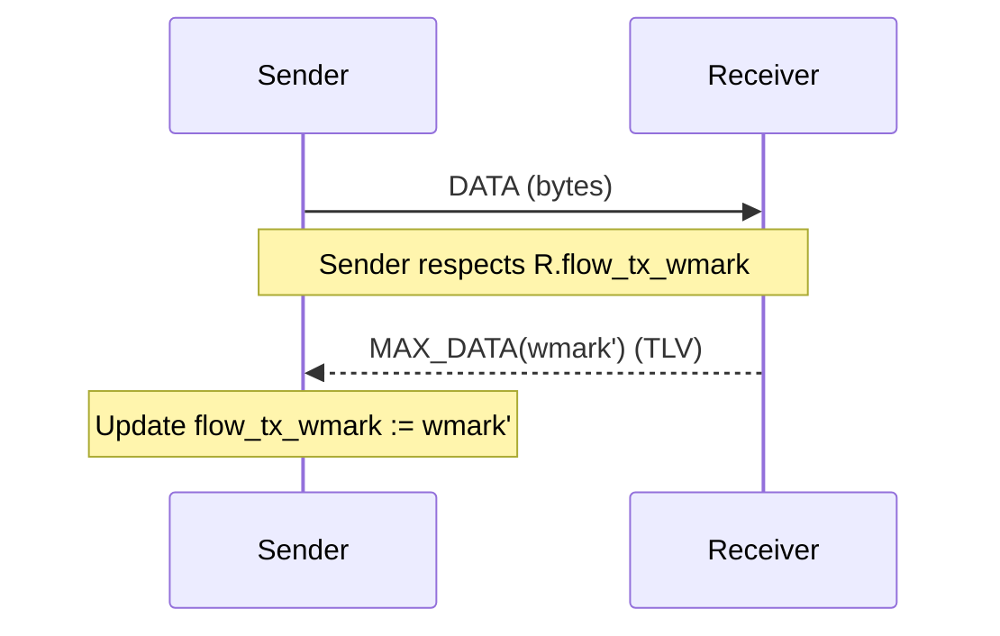
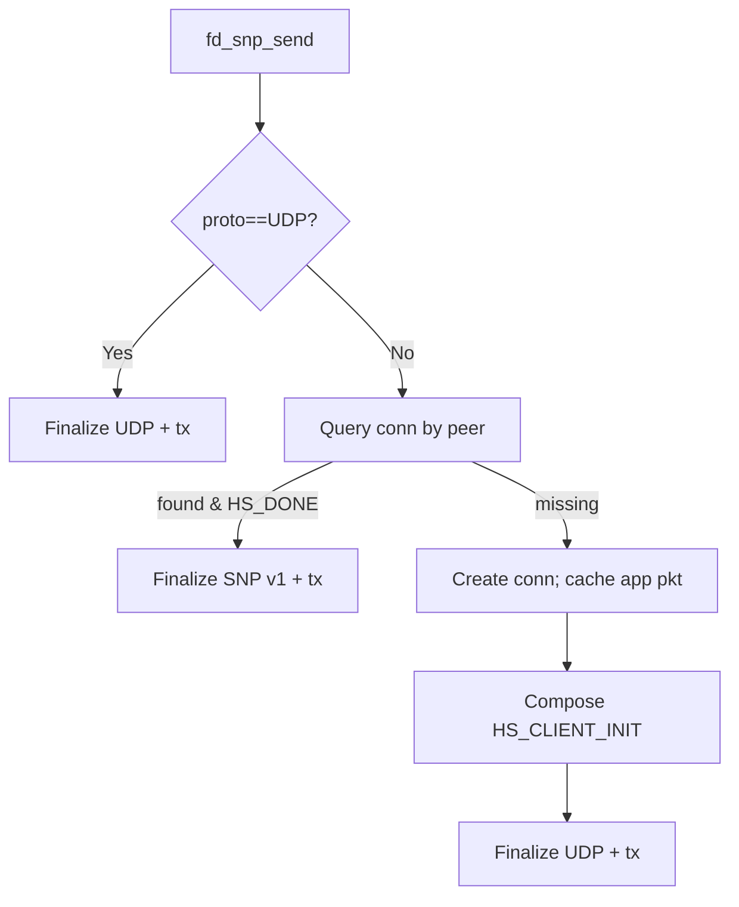
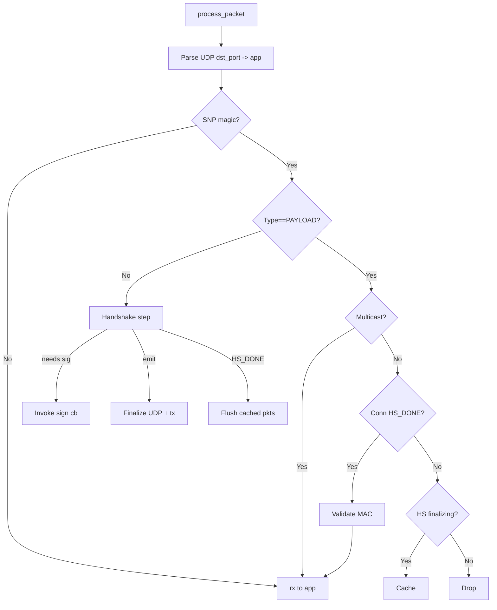

## Solana Network Protocol (SNP) — Technical Documentation

### Audience
- Researchers/engineers seeking a deep understanding of Firedancer’s SNP implementation.

### Scope
- Protocol overview (inspired by QUIC RFC 9000; multicast extension)
- State machines (handshake and data)
- Flow control and watermarking
- Callback interfaces and integration points
- Packet structure and wire formats

### Codebase
- Core: `src/waltz/snp/fd_snp.c`, `fd_snp.h`, `fd_snp_proto.h`, `fd_snp_v1.h`
- Tile: `src/disco/snp/fd_snp_tile.c`
- Tests/examples: `src/waltz/snp/test_*.c`

---

## 1. Overview

- SNP is a datagram protocol for Solana validator networking, inspired by QUIC (RFC 9000). It supports:
  - Authenticated, low-latency handshake with Ed25519 identities.
  - Optional key exchange and AEAD (suite S1); S0 is unauthenticated encryption offload with authentication.
  - Datagram payload delivery over UDP, with multicast support (quic-multicast style extension) for specific apps.
  - Lightweight flow control via watermark credits per connection.

```12:33:src/waltz/snp/fd_snp_proto.h
#define FD_SNP_V1 0x01
#define FD_SNP_TYPE_* /* HS_* and PAYLOAD types */
```

```mermaid
flowchart LR
  App -->|send()| SNP
  SNP -->|tx cb| UDP/IP
  UDP/IP --> Network
  Network --> UDP/IP
  UDP/IP -->|rx cb| SNP
  SNP -->|dispatch| App
```

---

## 2. Callback API and Applications

- SNP embeds application bindings (`apps[]`) with `port`, `net_id`, and cached `ip/udp` headers.
- Callbacks:
  - `tx(packet, packet_sz, meta)`: send over wire
  - `rx(packet, packet_sz, meta)`: deliver to application
  - `sign(session_id, to_sign)`: perform Ed25519 signature during handshake

```96:123:src/waltz/snp/fd_snp.h
struct fd_snp_callbacks { void* ctx; fd_snp_cb_tx_t tx; fd_snp_cb_rx_t rx; fd_snp_cb_sign_t sign; };
```

---

## 3. Connection Model and Flow Control

- SNP maintains a connection pool and a connection map keyed by `session_id` and by `peer_addr`.
- Flow control credits per connection:
  - `flow_rx_alloc`, `flow_rx_level`, `flow_rx_wmark`
  - `flow_tx_level`, `flow_tx_wmark`
- A receiver advertises its receive watermark with `FD_SNP_FRAME_MAX_DATA` TLV; sender enforces its tx watermark.

```146:175:src/waltz/snp/fd_snp_proto.h
struct fd_snp_conn { /* session ids, flow rx/tx levels and wmarks, is_server, is_multicast, last pkt, timestamps */ };
```



---

## 4. Handshake (SNP v1)

- States and messages:
  - `HS_CLIENT_INIT` → `HS_SERVER_INIT` → `HS_CLIENT_CONT` → `HS_SERVER_FINI` → `HS_CLIENT_FINI` → `HS_DONE`
  - Client/server exchange random challenges and ephemeral keys; server validates client’s challenge freshness (AES-128 state key); both sides authenticate with Ed25519 signatures; optional KEX/AEAD in S1.
  - During handshake, application data is cached per-connection and flushed upon `HS_DONE`.

```882:969:src/waltz/snp/fd_snp.c
switch(type) { CLIENT_INIT->SERVER_INIT; SERVER_INIT->CLIENT_CONT; CLIENT_CONT->SERVER_FINI; SERVER_FINI->CLIENT_FINI; CLIENT_FINI->ACPT }
``;

```mermaid
sequenceDiagram
  participant C as Client
  participant S as Server
  C->>S: HS_CLIENT_INIT (e, cookie?)
  S-->>C: HS_SERVER_INIT (r)
  C->>S: HS_CLIENT_CONT (r)
  S-->>C: HS_SERVER_FINI (e, enc_s1, enc_sig1) [needs signature]
  C->>S: Sign cb; send HS_CLIENT_FINI (enc_s1, enc_sig1)
  S-->>C: ACPT; both move to HS_DONE
```

Per-message packet formats:

```mermaid
%% HS_CLIENT_INIT
flowchart TB
  subgraph HS_CLIENT_INIT
    UDP[UDP/IP]
    SNP[SNP Header: V=1, Type=HS_CLIENT_INIT, SessionID]
    HS[Handshake Base: SrcSessionID]
    E[Client Ephemeral e[32]]
  end
  UDP --> SNP --> HS --> E
```

```mermaid
%% HS_SERVER_INIT
flowchart TB
  subgraph HS_SERVER_INIT
    UDP[UDP/IP]
    SNP[SNP Header: V=1, Type=HS_SERVER_INIT, SessionID]
    HS[Handshake Base: SrcSessionID]
    R[Server Random r[16]]
  end
  UDP --> SNP --> HS --> R
```

```mermaid
%% HS_CLIENT_CONT
flowchart TB
  subgraph HS_CLIENT_CONT
    UDP[UDP/IP]
    SNP[SNP Header: V=1, Type=HS_CLIENT_CONT, SessionID]
    HS[Handshake Base: SrcSessionID]
    R[Reflect Random r[16]]
  end
  UDP --> SNP --> HS --> R
```

```mermaid
%% HS_SERVER_FINI
flowchart TB
  subgraph HS_SERVER_FINI
    UDP[UDP/IP]
    SNP[SNP Header: V=1, Type=HS_SERVER_FINI, SessionID]
    HS[Handshake Base: SrcSessionID]
    E[Server Ephemeral e[32]]
    ENC_S1[enc_s1 (32+16)]
    ENC_SIG1[enc_sig1 (64+16)]
  end
  UDP --> SNP --> HS --> E --> ENC_S1 --> ENC_SIG1
```

```mermaid
%% HS_CLIENT_FINI
flowchart TB
  subgraph HS_CLIENT_FINI
    UDP[UDP/IP]
    SNP[SNP Header: V=1, Type=HS_CLIENT_FINI, SessionID]
    HS[Handshake Base: SrcSessionID]
    ENC_S1[enc_s1 (32+16)]
    ENC_SIG1[enc_sig1 (64+16)]
  end
  UDP --> SNP --> HS --> ENC_S1 --> ENC_SIG1
```

---

## 5. Send Path

- `fd_snp_send(snp, packet, packet_sz, meta)`:
  1. If `meta.proto==UDP`, finalize UDP and `tx`.
  2. Lookup conn by `peer_addr`; if established, finalize SNP (v1), check tx credits, and `tx`.
  3. If missing conn: create conn (alloc flow credits), cache current app packet (optional), start handshake with `HS_CLIENT_INIT`.

```675:746:src/waltz/snp/fd_snp.c
/* send path */ if UDP -> tx; else query conn; if HS_DONE -> snp_v1_finalize; else create conn and start handshake
```



---

## 6. Receive Path

- `fd_snp_process_packet(snp, packet, packet_sz)`:
  1. Parse UDP headers; identify app by port.
  2. Detect SNP by magic in header; set `meta.proto`.
  3. If UDP: `rx` to app.
  4. If SNP PAYLOAD:
     - Multicast? deliver directly.
     - Lookup conn; if established, validate MAC, return to app; if in finalization state, cache.
     - Handle flow control TLVs (`MAX_DATA`), update watermarks.
  5. Else (handshake type): run v1 state-machine transitions and emit responses; invoke `sign` callback when needed; upon `HS_DONE`, flush cached packets in both directions.

```767:988:src/waltz/snp/fd_snp.c
/* receive path */ parse UDP; detect SNP; if UDP -> rx; else handle PAYLOAD or HS_* types + caching and signature flow
```



---

## 7. Multicast

- Some apps are multicast-enabled: SNP emits UDP/IP headers with multicast destination and omits per-connection MAC.
- `fd_snp_finalize_multicast_and_invoke_tx_cb` crafts a multicast datagram (no per-conn auth) and calls `tx`.

```494:533:src/waltz/snp/fd_snp.c
/* multicast finalize */ packet_sz-=19; snp_hdr; copy multicast headers; tx
```

---

## 8. Flow Control: Watermarks and Housekeeping

- Housekeeping timers:
  - Retry handshake up to N times at fixed intervals; drop inactive connections; send keepalive PING; update RX watermark when level approaches threshold and notify peer with `MAX_DATA` TLV.

```1030:1104:src/waltz/snp/fd_snp.c
/* housekeeping */ retries; timeout; keepalive ping; rx wmark update; send MAX_DATA TLV
```

---

## 9. Packet Formats (v1)

### 9.1 Common SNP Header

```text
0                   1                   2                   3
0 1 2 3 4 5 6 7 8 9 0 1 2 3 4 5 6 7 8 9 0 1 2 3 4 5 6 7 8 9 0 1
+-+-+-+-+-+-+-+-+-+-+-+-+-+-+-+-+-+-+-+-+-+-+-+-+-+-+-+-+-+-+-+-+
|   'S'   |   'N'   |   'P'   |V|Type|        (unused)          |
+-+-+-+-+-+-+-+-+-+-+-+-+-+-+-+-+-+-+-+-+-+-+-+-+-+-+-+-+-+-+-+-+
|                        Session ID (64)                        |
+-+-+-+-+-+-+-+-+-+-+-+-+-+-+-+-+-+-+-+-+-+-+-+-+-+-+-+-+-+-+-+-+
```

### 9.2 Handshake Packets (selected fields)

- `HS_CLIENT_INIT`/`HS_SERVER_INIT`: ephemeral key shares and random challenges
- `HS_CLIENT_CONT`/`HS_SERVER_FINI`/`HS_CLIENT_FINI`: encrypted pubkeys and Ed25519 signatures (optionally via AEAD in S1)

```30:66:src/waltz/snp/fd_snp_v1.h
struct fd_snp_v1_pkt_hs { version; session_id; src_session_id; }
/* client/server variants carry e, r, enc_s1, enc_sig1 */
```

### 9.3 Payload Packet (with TLV)

```text
UDP/IP | SNP Header | Frame Type (1B) | Length (2B) | Data ... | MAC(16)

Frame types:
  0x01 DATAGRAM: carries up to SNP_BASIC_PAYLOAD_MTU bytes
  0x02 MAX_DATA: TLV with 8B watermark value
  0x03 PING    : keepalive (no data)
```

```471:489:src/waltz/snp/fd_snp.c
/* verify path */ data_offset = UDP_HDRS + 12; switch(frame) DATAGRAM/PING
```

---

## 10. Error Handling and Retries

- Per-conn retry cache of last packet for handshake retransmission; capped retry count and timeouts; validation failures drop gracefully without affecting other conns.

```552:575:src/waltz/snp/fd_snp.c
fd_snp_cache_packet_for_retry; fd_snp_retry_cached_packet
```

---

## 11. Diagrams and Rendering

Mermaid sources in `docs/diagrams`:
- `snp-overview.mmd`
- `snp-handshake.mmd`
- `snp-send.mmd`
- `snp-recv.mmd`
- `snp-packets.mmd`

To render PNGs (Docker approach):

```bash
docker run --rm -u "$(id -u)":"$(id -g)" -v "$PWD":/data minlag/mermaid-cli \
  mmdc -i docs/diagrams/snp-overview.mmd   -o docs/diagrams/snp-overview.png
docker run --rm -u "$(id -u)":"$(id -g)" -v "$PWD":/data minlag/mermaid-cli \
  mmdc -i docs/diagrams/snp-handshake.mmd  -o docs/diagrams/snp-handshake.png
docker run --rm -u "$(id -u)":"$(id -g)" -v "$PWD":/data minlag/mermaid-cli \
  mmdc -i docs/diagrams/snp-send.mmd       -o docs/diagrams/snp-send.png
docker run --rm -u "$(id -u)":"$(id -g)" -v "$PWD":/data minlag/mermaid-cli \
  mmdc -i docs/diagrams/snp-recv.mmd       -o docs/diagrams/snp-recv.png
docker run --rm -u "$(id -u)":"$(id -g)" -v "$PWD":/data minlag/mermaid-cli \
  mmdc -i docs/diagrams/snp-packets.mmd    -o docs/diagrams/snp-packets.png
```


