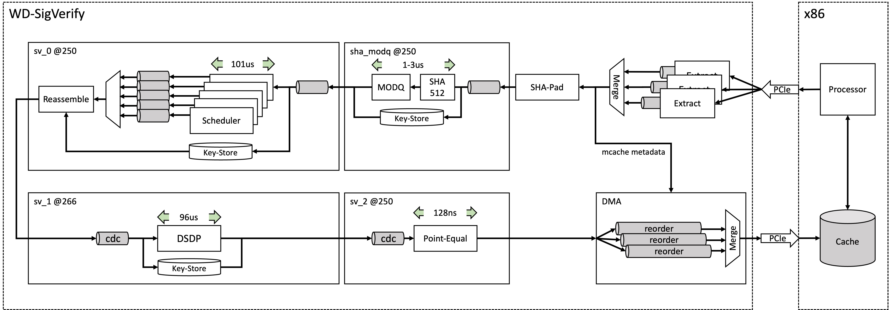
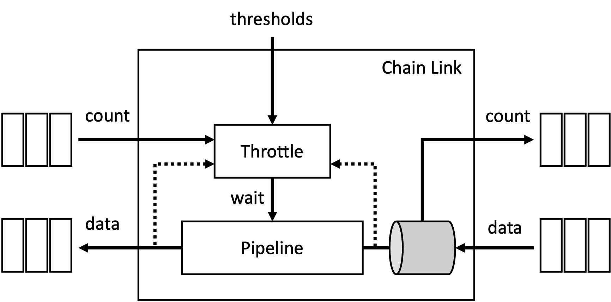

# WireDancer #
This directory includes all resources to build and use Wiredancer functionalities.

## Supported Platforms ##
* AWS-F1 series

## Available Functions ##
* SigVerify

# Using WD inside FD #

WD adopts an asynchronous API.  In fact WD uses the same Tango mcache mechanism to publish results back into FD.  All requests to WD are sent with a push model, and results are pushed back into mcaches.

## WD API ##

- `wd_init_pci(wd_wksp_t*, uint64_t slots)`
  - Initializes PCIe interfacing with FPGA card(s).  Multiple cards can be specified as bits in the `slots` argument.  For example, `slots=3` asks for first and second slots to be initialized.
- `wd_free_pci(wd_wksp_t*)`
  - Frees PCIe resources.

#  #
# Building WD #

## AWS-F1 Series ##

+ To build for AWS-F1 series EC2 instances, you need an EC2 build machine.  Detailes to provision such instance are provided in [AWS-FPGA github page](https://github.com/aws/aws-fpga).

+ Inside the build machine, clone AWS-FPGA git repo
  - `git clone https://github.com/aws/aws-fpga`

- Follow the repo's instructions to build `<AWS-FPGA>/hdk/cl/examples/cl_dram_dma`

+ Copy all files from `<FD>/wiredancer/platforms/f1/build` directory into `<AWS-FPGA>/hdk/cl/examples/cl_dram_dma` replacing existing files.

+ Rebuild `<AWS-FPGA>/hdk/cl/examples/cl_dram_dma` with the same instructions from AWS repo as before.

#  #
# Running WD #

## AWS-F1 Series ##

+ To run FD with WD support, you need an EC2 F1 machine.

+ Inside the machine, clone AWS-FPGA git repo
  - `git clone https://github.com/aws/aws-fpga`

+ Install the SDK inside the repo:
  - `source $AWS-FPGA/sdk_setup.sh`

+ Load WD image on FPGA slot-0
  - `sudo fpga-load-local-image -S 0 -I agfi-01051ff14d1bba4e0`

+ Make FD with WD support
  - `./deps.sh`
  - `source activate-opt`
  - `make MACHINE=linux_gcc_wd_f1 -j`

+ Configure FD
  - `sudo build/linux/gcc/x86_64/bin/fd_shmem_cfg reset`
  - `sudo build/linux/gcc/x86_64/bin/fd_shmem_cfg fini`
  - `sudo build/linux/gcc/x86_64/bin/fd_shmem_cfg alloc 32 gigantic 0  alloc 512 huge 0`
  - `sudo build/linux/gcc/x86_64/bin/fd_shmem_cfg init 0700 $USER ""`
  - `sudo build/linux/gcc/x86_64/bin/fd_shmem_cfg query`

+ Configure app-frank
  - `sudo ./build/linux/gcc/x86_64/bin/fd_frank_init_demo frank 1-6 ./build/linux/gcc/x86_64 /tmp/solana.pcap 0 0 1 0`

+ Run app-frank
  - `sudo ./build/linux/gcc/x86_64/bin/fd_frank_run frank "1-6"`

+ Run wd-monitor
  - `sudo taskset -c 7 build/linux/gcc/x86_64/bin/wd_frank_mon frank --duration 0`

+ Run fd-monitor
  - `sudo taskset -c 7 build/linux/gcc/x86_64/bin/fd_frank_mon frank --duration 10e12 --dt-min 1e7 --dt-max 1e7`

#  #
# WD-SigVerify #

SigVerify is the verification process of [ED25519](https://en.wikipedia.org/wiki/EdDSA).  This is a computationally intesive operation.  In order to match SigVerify's throughput with the rest of the FD system, many high performance cores are required.  However WD.SigVerify uses hardware acceleration to achieve 1Mps throughput using only one FPGA.  Table below shows the throughput of a single core running FD.SigVerify on various architectures, and the number of cores required to reach a throughput of one million per second.

| Architecture      | Throughput        | Cores/Cards   |
| -                 | -                 | -             |
| Skylake 2.4GHz    | 30 Kps            | 33            |
| AWS-F1            | 1000 Kps          | 1             |

## WD.SigVerify API ##

WD.SigVerify utilizes an asyncronous API: software pushes requests to the accelerator, and the accelerator pushes results to software.  

- `wd_ed25519_verify_init_req`
  - Initializes request API.  By default all signature failures are dropped and no response is sent back to software.  This is feature is programmable here.  All fields pertaining to response's tango.mcache are also provided here.
- `wd_ed25519_verify_init_resp`
  - Initializes response API.
- `wd_ed25519_verify_req`
  - Pushes a new verification request to the accelerator.  In addition to regular FD.sigverify parameters, details of the mcache to be populated in response are also provided here

## WD.SigVerify Design ##

In the design of WD.SigVerify, given hard requirements for area and latency, the goal is to maximize throughput.  Due to the nature of FPGA devices, clock speed is, on average, ~1/10 of the host processor (for example 2.4GHz CPU vs 250MHz FPGA).  This leads to higher latency for a single transaction.  However, taking advantage of pipelining and parallelism, WD compensates for the lost latency by overlapping the processing of multiple transactions at the same time, to reach very high (>1Mps) thourghput.

### Batchless Parallelism ###
Unlike GPU-style aceleration, WD.Sigverify does not require multiple transactions to be batched together to reach its maximum throughput.  All requests are processed independently, yet in parallel.  As such, transaction arrival times do not impact system throughput.

### Pipeline Design

Every transaction goes through multiple steps (detailed further in this document), with each step posing uniqe challenges when it comes to hardware implementation and acceleration.  The main goal is to form a single chain of pipelined blocks, that provides maximum throughput, while the latency and area are kept at a reasonable and practical level.

Figure below shows the overall pipeline design of WD.SigVerify.  It is composed of a chain link of pipelines, with each pipeline having its own unique throughput and latency characteristics highlighted in the figure.

We solve the the queueing problem of concatenating pipelines of different latency and throughput by utilizing a credit-based chain link system.  All links follow the diagram below:

- Chain links do not backpressure previous link.
- Chain links do not accept backpressure from the next link.
- All links have an input fifo for the pipeline inside them.
- All links include a throttle (rate limiter).
- A link's rate limiting is determined by three metrics and three parameter thresholds:
  - `A`: Number of transactions inside the fifo of the next link.
  - `B`: Number of transactions inside the pipeline.
  - `C`: Number of cycles since last data was popped from the fifo.
  - wait if `A >= T0`
  - wait if `A+B >= T1`
  - wait if `C < T2`

This pipeline design allows for arbitrary number of registers along the connections between links.  This is especially required for timing closure when crossing SLRs in a multi-SLR FPGA, such as the VU9P present in AWS-F1 systems.  This design also allows to create m-n connections between chain links, however this is not applicable to WD-SV.  

Pseudocode below outlines an algorithmically optimized ED25519 verification procedure, broken into four steps:
- SHA
  - `h = sha512_modq(sig_l + pub + msg)`
- SV0
  - `A = point_decompress(pub)`
  - `R = point_decompress(sig_l)`
  - `r = <various sanity checks>`
- SV1
  - `T = dsdp_mul(A, G, sig_h, -h)`
- SV2
  - `return r & point_equal(T, R)`

`SHA`: This step is a straight forward SHA-512 of the message and modular reduction.  We implement this steps as a fully pipelined module, with a variable latency (based on message size) of `1-3.5` microsecond at `250MHz`.  Since the latency of this step is dependent on the message size, output can be out of order.

`SV0`: This step includes many data-dependent control flows.  As such, we opt to create a custom processor/scheduler to execute necessary instructions for each transaction.  The sequence of instructions to be executed is extracted from a reference python model, utilizing the `Expr` class, details of which are provided inside `ed25510_lib.py`.  A single processor can accommodate `22` pending transactions at a time, with a latency of `101` microseconds at `250MHz`.  Accordingly, we require five instances of the processor to achieve a throughput of `1.08` million per second.

`SV1`: This step includes the optimized double-scalar double-point multiplication, similar to the algorithm mentioned [here](https://cryptojedi.org/peter/data/eccss-20130911b.pdf).  This algorithm is very regular in terms of dataflow, and all the if-statements can be accommodated with simple multiplexers.  However, the dynamic execution includes many invocations of modular-multiplications, hence creating a fully-pipelined implementation is required to keep latency reasonable.  Our implementation achieves `~96` microseconds of latency at `266MHz`, and a throughput of `1.04` million per second.

`SV2`: This final step includes two modular-multiplcations as is required in point equality checks in twisted-edwards coordinates.  We employ one modular-multiplier unit in this step, and use it in two subsequent cycles, achieving a latency of `72` nano seconds at `250MHz`, and a throughput of `125` million per second.

